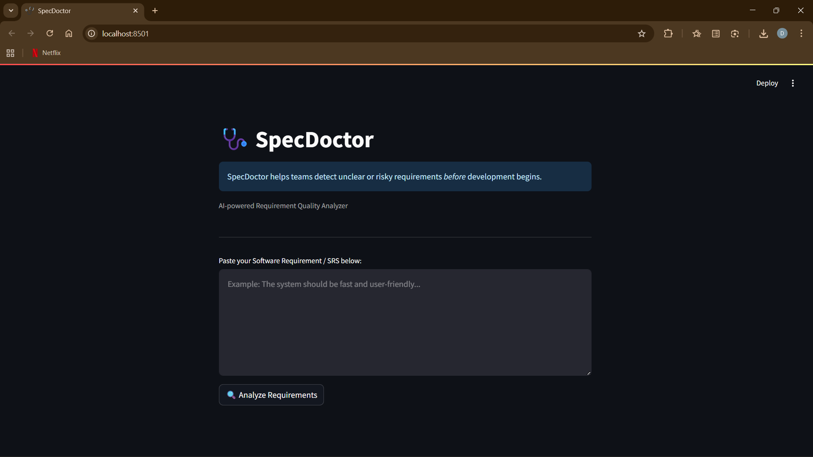
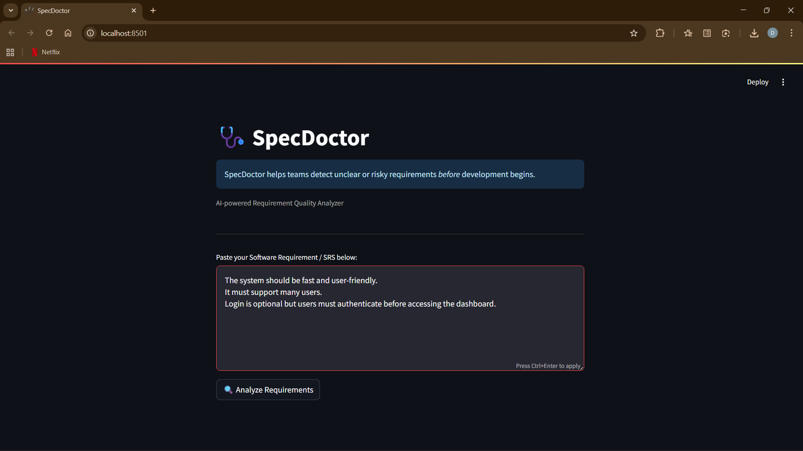
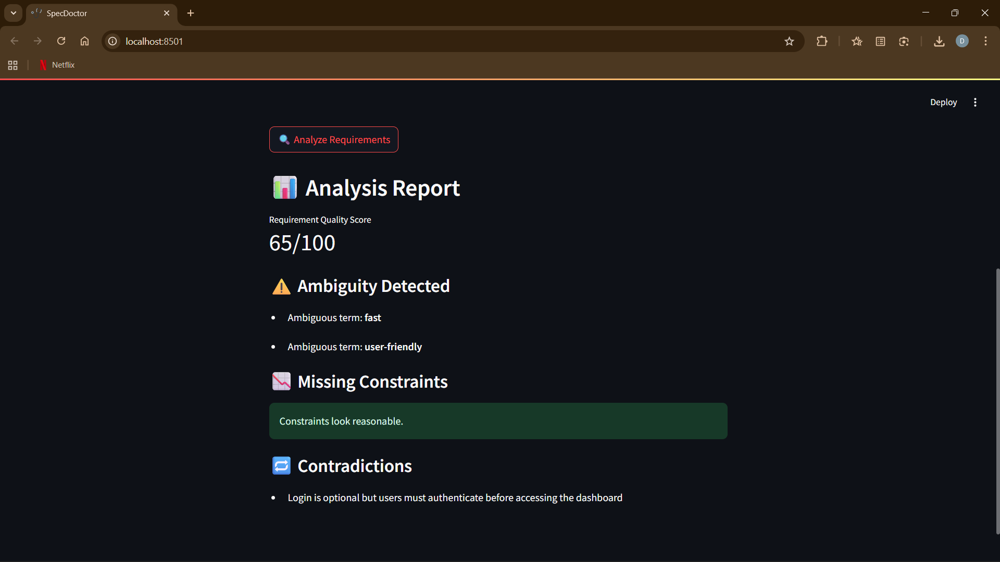

# SpecDoctor 🩺

SpecDoctor is an AI-powered requirement analysis tool that helps identify ambiguity,
missing constraints, and contradictions in software specifications.

## Features
- Requirement quality scoring
- Ambiguous word detection
- Missing constraint analysis
- Contradiction detection
- Clean Streamlit UI

## Tech Stack
- Python
- Streamlit
- NLP

## Use Case
Improves software quality by detecting requirement issues before development starts.

## 📷 Screenshots

